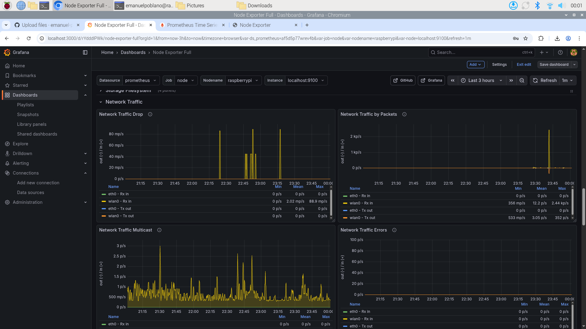
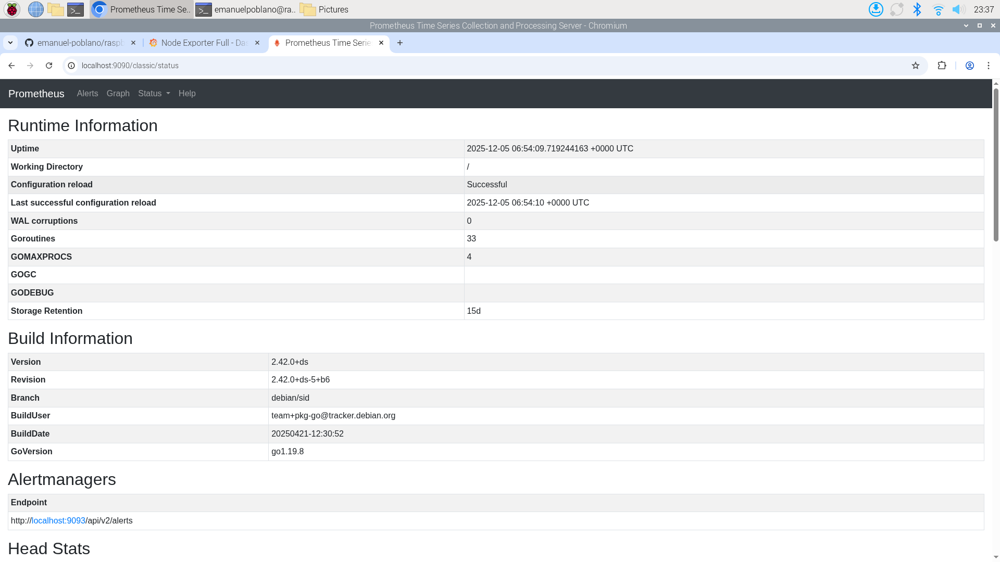
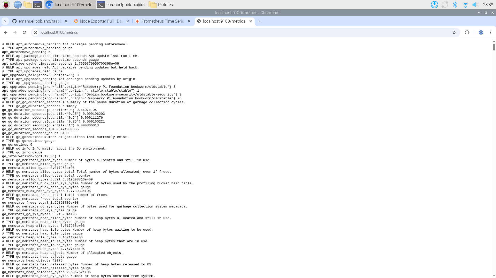

# Raspberry Pi Network Monitor 📡

A **self-hosted network monitoring solution** built on a Raspberry Pi using **Prometheus**, **Grafana**, and **Node Exporter**.

This project provides real-time visibility into:

* Network traffic
* Device performance
* System health (CPU, RAM, disk)

Perfect for **home networks, homelabs, and small offices**.

---

## ✨ Features

* 📊 Real-time dashboards with Grafana
* 📈 CPU, RAM, disk, and network monitoring
* ⚡ Lightweight and Raspberry Pi–friendly
* 🔄 Auto-start services using systemd
* 🌐 Web-based UI accessible from any device

---

## 📸 Screenshots

### Grafana Dashboard – Node Exporter


### Grafana Dashboard - Node Exporter - Network Traffic


### Prometheus


### Node Exporter Metrics



---

## 🧱 Tech Stack

| Component       | Purpose                    |
| --------------- | -------------------------- |
| Raspberry Pi OS | Base operating system      |
| Prometheus      | Metrics collection         |
| Grafana         | Visualization & dashboards |
| Node Exporter   | System metrics exporter    |

---

## 📦 Requirements

* Raspberry Pi 4 (2GB+ recommended)
* Raspberry Pi OS (Bookworm or newer)
* 16GB+ microSD card
* Ethernet connection (recommended)

---

## 🚀 Installation

### 1️⃣ Update System

```bash
sudo apt update && sudo apt upgrade -y
```

---

### 2️⃣ Install Prometheus

```bash
sudo apt install prometheus -y
```

Verify service:

```bash
systemctl status prometheus
```

* Prometheus URL: `http://<pi-ip>:9090`

---

### 3️⃣ Install Node Exporter

Node Exporter exposes system metrics such as CPU, memory, disk, and network usage.

```bash
cd /opt
sudo wget https://github.com/prometheus/node_exporter/releases/download/v1.6.1/node_exporter-1.6.1.linux-armv7.tar.gz
sudo tar xvf node_exporter-1.6.1.linux-armv7.tar.gz
sudo mv node_exporter-1.6.1.linux-armv7 node_exporter
```

#### Create systemd service

```bash
sudo nano /etc/systemd/system/node_exporter.service
```

```ini
[Unit]
Description=Node Exporter

[Service]
User=pi
ExecStart=/opt/node_exporter/node_exporter

[Install]
WantedBy=default.target
```

Enable service:

```bash
sudo systemctl daemon-reload
sudo systemctl enable --now node_exporter
```

* Node Exporter runs on **port 9100**

---

### 4️⃣ Install Grafana (Modern Keyring Method)

#### Import Grafana GPG key

```bash
wget -q https://apt.grafana.com/gpg.key
gpg --show-keys gpg.key
```

```bash
sudo mkdir -p /etc/apt/keyrings
sudo gpg --dearmor gpg.key
sudo mv gpg.key.gpg /etc/apt/keyrings/grafana.gpg
sudo chmod 644 /etc/apt/keyrings/grafana.gpg
```

#### Add repository & install

```bash
echo "deb [signed-by=/etc/apt/keyrings/grafana.gpg] https://apt.grafana.com stable main" | \
sudo tee /etc/apt/sources.list.d/grafana.list

sudo apt update
sudo apt install grafana -y
sudo systemctl enable --now grafana-server
```

* Grafana URL: `http://<pi-ip>:3000`
* Default login: **admin / admin**

---

### 5️⃣ Connect Prometheus to Grafana

1. Open Grafana
2. Go to **Settings → Data Sources**
3. Select **Prometheus**
4. URL:

   ```
   http://localhost:9090
   ```
5. Save & Test

---

### 6️⃣ Import Dashboard

1. Grafana → **Create → Import**
2. Use Dashboard ID:

```
1860
```

**Node Exporter Full Dashboard**

---

## 🖥️ Result

You now have a **professional-grade network monitoring dashboard** showing:

* Network throughput
* System resource usage
* Performance trends

Comparable to tools like **Netdata** or **Ubiquiti dashboards**.

---

## 🔁 Service Management

All services auto-start on reboot.

Check status:

```bash
systemctl status prometheus\systemctl status grafana-server\systemctl status node_exporter
```

---

## 🧩 Optional Enhancements

* Pi-hole DNS monitoring
* Alerting with Prometheus Alertmanager
* Telegram / email notifications
* Custom Grafana dashboards

---

## 📜 License

MIT License

---

## 🤝 Contributing

Pull requests are welcome.
For major changes, please open an issue first to discuss what you would like to change.

---

## ⭐ Support

If you found this project useful, consider giving it a ⭐ on GitHub
